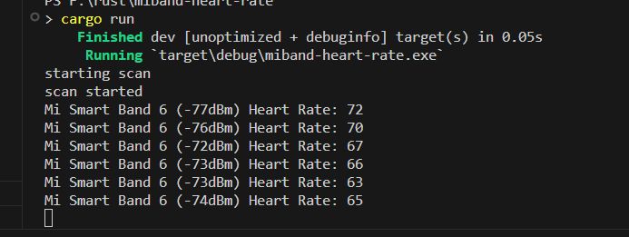

# MiBand Heart Rate for OBS

> This edition listening at <http://127.0.0.1:3030> so you can use it on OBS browser source.
>
> 该版本在 <http://127.0.0.1:3030> 监听HTTP请求，你可以在 OBS 中将其添加为浏览器源。以在直播时显示心率。

A Demo of reading "Shear heart rate data" of Xiaomi Smart Band 10. Enable the option in official App is required.

接收小米手环10 “运动心率广播” Demo，需在手环设置-心率广播中开启广播功能。

## Supported Platform

I use `bluest` crate. I copy its words below.

> Bluest is a cross-platform Bluetooth Low Energy (BLE) library for Rust. It currently supports Windows (version 10 and later), MacOS/iOS, and Linux. Android support is planned.

So it supported:

- Windows 10/11
- MacOS/iOS
- Linux

## Supported MiBands

MiBand 10 小米手环 10

Tested on MiBand10/NFC.

## Screenshot

